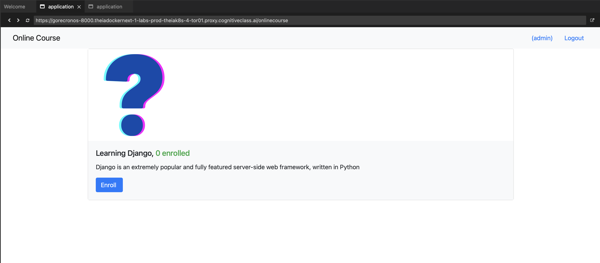
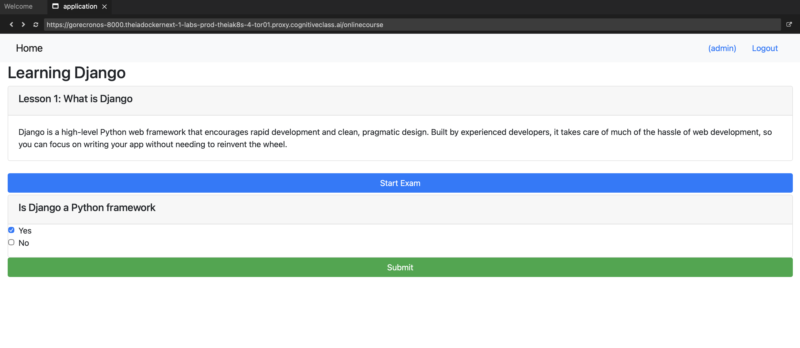

# Online Course - Proyecto final Django IBM

[View in English](README.md)

Este repositorio contiene mi version del proyecto final del curso **Django Application Development with SQL and Databases** de IBM. La base del ejercicio parte del material proporcionado por **IBM Developer Skills Network**, y sobre ese repositorio he trabajado la implementacion y adaptacion del proyecto como practica personal.

La aplicacion es una plataforma sencilla de cursos online hecha con Django. Permite registrar usuarios, iniciar sesion, consultar cursos, matricularse, ver lecciones y realizar un pequeno test asociado a cada curso.

## Contexto

Este proyecto no pretende ser una plataforma de e-learning completa, sino una practica academica orientada a reforzar conceptos de Django y bases de datos:

- Modelado de datos con Django ORM.
- Relaciones entre usuarios, cursos, lecciones, inscripciones, preguntas, opciones y entregas.
- Vistas basadas en clases y vistas funcionales.
- Formularios basicos con plantillas Django.
- Uso del panel de administracion para gestionar contenido.
- Persistencia con SQLite en desarrollo.
- Preparacion basica para despliegue con Gunicorn y Cloud Foundry.

## Funcionalidades principales

- Listado de cursos disponibles.
- Registro, login y logout de usuarios.
- Inscripcion de usuarios autenticados en cursos.
- Vista de detalle con lecciones del curso.
- Test por curso con preguntas y opciones de respuesta.
- Registro de entregas mediante el modelo `Submission`.
- Calculo de puntuacion comparando las respuestas seleccionadas con las opciones correctas.
- Administracion de cursos, lecciones, instructores, estudiantes, preguntas, opciones y entregas desde Django Admin.

## Estructura del proyecto

```text
.
|-- manage.py
|-- myproject/              # Configuracion principal del proyecto Django
|-- onlinecourse/           # Aplicacion principal de cursos
|   |-- models.py           # Modelos de dominio
|   |-- views.py            # Vistas de cursos, usuarios, examenes y resultados
|   |-- urls.py             # Rutas de la app
|   |-- admin.py            # Configuracion del admin
|   `-- templates/          # Plantillas HTML con Bootstrap
|-- static/                 # Archivos estaticos y recursos del curso
|-- images/                 # Capturas usadas para documentacion
|-- requirements.txt
|-- Procfile
|-- manifest.yml
`-- runtime.txt
```

## Capturas

Las siguientes imagenes son capturas tomadas por mi para documentar el estado de la aplicacion y se incluyen dentro del repositorio.

Menu inicial con el listado de cursos:



Vista de un curso con el test desplegado:



## Modelos principales

La app `onlinecourse` define los modelos basicos del dominio:

- `Course`: curso, descripcion, imagen, fecha de publicacion e instructores.
- `Lesson`: contenido asociado a un curso.
- `Enrollment`: relacion entre usuario y curso.
- `Question`: pregunta asociada a un curso.
- `Choice`: posible respuesta de una pregunta, con indicador de respuesta correcta.
- `Submission`: entrega de un examen con las opciones seleccionadas.
- `Instructor` y `Learner`: perfiles vinculados a usuarios de Django.

## Ejecucion local

1. Crear y activar un entorno virtual:

```bash
python -m venv venv
source venv/bin/activate
```

2. Instalar dependencias:

```bash
pip install -r requirements.txt
```

3. Aplicar migraciones:

```bash
python manage.py migrate
```

4. Crear un superusuario para gestionar cursos y preguntas desde el admin:

```bash
python manage.py createsuperuser
```

5. Arrancar el servidor:

```bash
python manage.py runserver
```

La aplicacion quedara disponible en:

```text
http://127.0.0.1:8000/onlinecourse/
```

El panel de administracion estara en:

```text
http://127.0.0.1:8000/admin/
```

## Notas sobre IBM y autoria

Este repositorio procede de un fork/material base del curso de IBM Developer Skills Network. La finalidad es educativa y el desarrollo incluido aqui corresponde a mi trabajo y adaptacion del proyecto final del curso **Django Application Development with SQL and Databases**.

Se mantiene la referencia a IBM porque el planteamiento original, la estructura inicial del laboratorio y parte de los recursos pertenecen al contexto formativo del curso.

## Estado del proyecto

Proyecto academico finalizado como practica de Django. Puede servir como referencia sencilla para entender como conectar modelos, vistas, plantillas y relaciones SQL en una aplicacion web basica.
